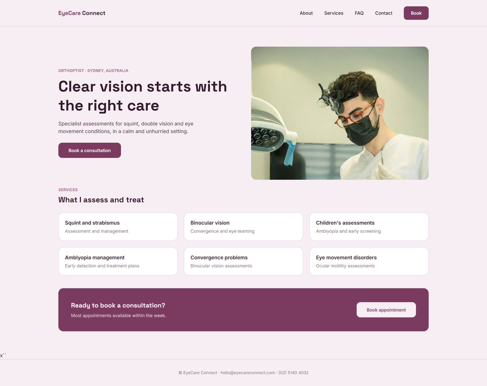

# EyeCare Connect

A full-stack booking website for an orthoptic (eye care) clinic, designed and built end to end by me from visual design through deployment.

**Live demo:** https://eyecare-connect-b8anc9b97-apra-k.vercel.app/



## About this project

EyeCare Connect is a booking platform built for a solo orthoptic practice. The brief was straightforward: a clean, trustworthy, mobile-first website that makes it easy for patients to learn about the practitioner's services and book a consultation online, without the overhead of a full hospital-style system.

I owned the project end to end — visual design and colour system, component architecture, the multi-step booking flow, backend email notifications, and deployment.

## Features

- **Responsive design** across mobile and desktop, built mobile-first with Tailwind CSS
- **Multi-step booking flow** (consultation type -> date & time -> contact details -> review -> confirmation), driven by a `useReducer`-based state machine
- **FAQ accordion** and **mobile navigation menu** using component-level state
- **Contact form** with controlled inputs and client-side validation
- **Email notifications** on booking and contact form submission, via the Resend API
- Custom design system (colour tokens, typography) implemented with Tailwind's `@theme` layer

## Tech stack

- **Framework:** Next.js (App Router)
- **Language:** TypeScript
- **Styling:** Tailwind CSS
- **Email:** Resend API
- **Deployment:** Vercel

## Pages

| Route | Description |
|---|---|
| `/` | Home -- hero, services preview, call to action |
| `/about` | Practitioner profile and areas of expertise |
| `/services` | Full list of services offered |
| `/faq` | Accordion-style frequently asked questions |
| `/contact` | Contact form with email notification |
| `/book` | Multi-step appointment booking flow |

## Notable implementation details

- **State management:** the booking flow uses `useReducer` rather than multiple `useState` calls, since several pieces of state (step, selected service, selected time, form fields) change together and needed to be updated atomically.
- **API routes:** `/api/contact` and `/api/bookings` are Next.js server-side route handlers that validate incoming data and trigger transactional emails via Resend.
- **Type safety:** booking state, actions, and service data are fully typed, including a discriminated union for reducer actions.
- **Design system first:** colours, spacing and typography were defined as design tokens before any page was built, so every component pulls from the same source of truth.

## Running locally

```bash
git clone https://github.com/ap23hp/eyecare-connect.git
cd eyecare-connect
npm install
```

Create a `.env.local` file in the project root with:

```
RESEND_API_KEY=your_resend_api_key
```

Then run:

```bash
npm run dev
```

and open [http://localhost:3000](http://localhost:3000).

## A note on email delivery

Since this project doesn't have a purchased and verified sending domain, live emails are currently limited to a single verified test address rather than any address entered in the forms. Verifying a sending domain (SPF/DKIM/DMARC records) with Resend would remove this restriction in a production deployment. This is also noted directly in the app's UI.

## Future improvements

- Persist bookings and contact submissions to a database
- Admin dashboard for the practitioner to view and manage upcoming appointments
- Authentication for the admin view
